# Welcome to My Project

This project is designed to help you get started with Urban Solarium website . Whether you're a developer looking to contribute or a user interested in learning more, you've come to the right place!

## About this website

This is a website for urban solarium, 
## Getting Started

To get started with urban solarium , follow these simple steps:

1. Clone the repository to your local machine.
2. Install the necessary dependencies.
3. Run the application.
4. Explore the features and functionalities.

For detailed installation instructions, please refer to the [Documentation](#).

## Screenshots

## Domain deployment 

### 1. Find Netlifty DNS through from nslookup.io
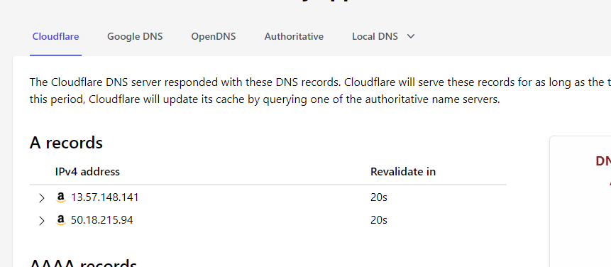

### 2. Put the Netlify DNS to cloudfare DNS management tab
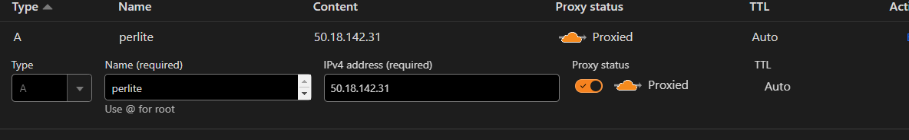

### 3. Set the Cloudflare Nameservers to the custom Niagahoster Nameserver
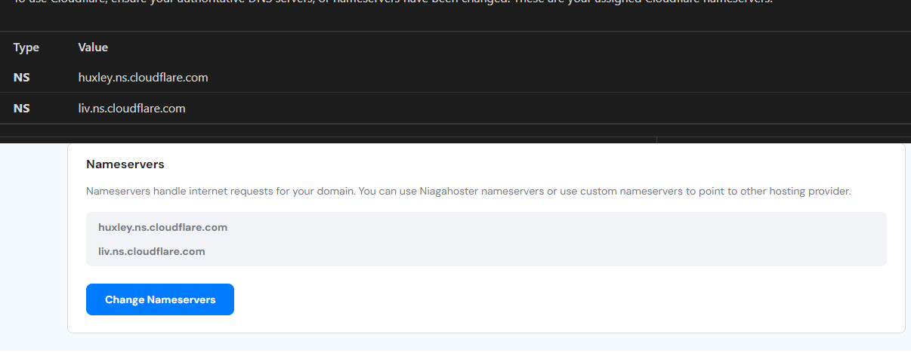

### 4. Wait ~ 24 hours to get the DNS adress, then add your domain in netlify
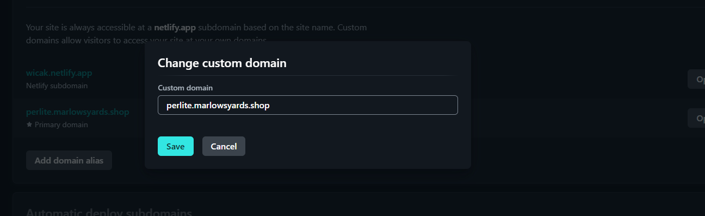

<!-- ### Dashboard

### About us

### Reach us 

### Mobile view 1

### mobile view 2

### Scrset 

### testimonials 

 -->

### Branching

#### Making new branch
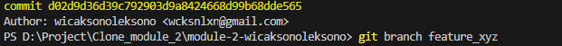

#### Manuvering through branch
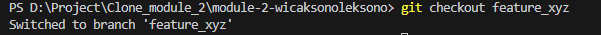

#### Pushing branch
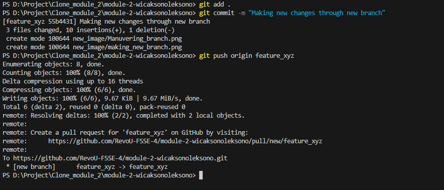

#### Pull request and merging
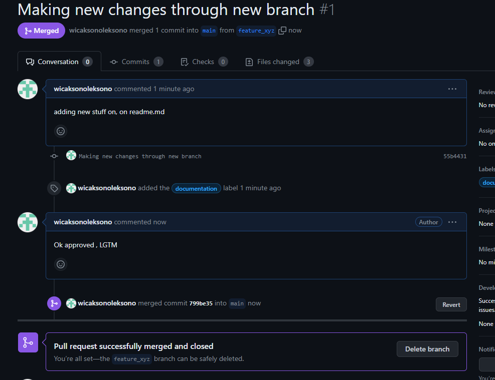

#### Deleting branch
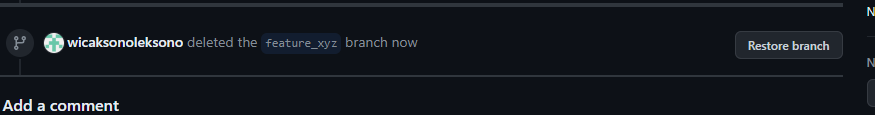

#### Pull after merge
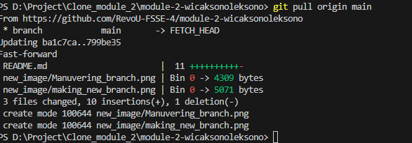

#### Custom domain
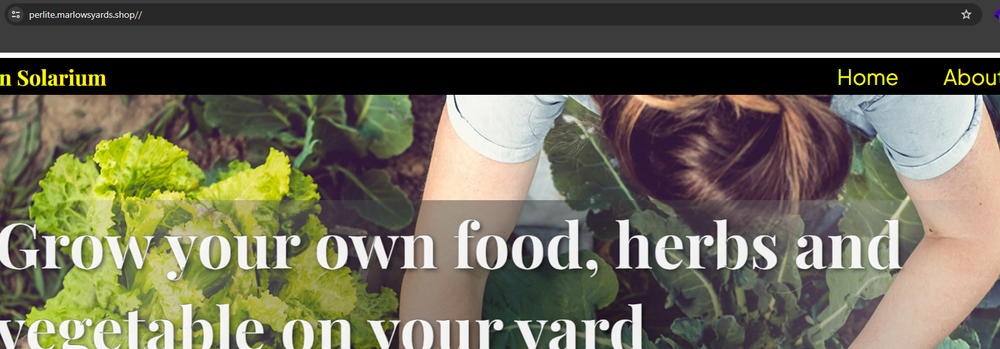

#### Domain information
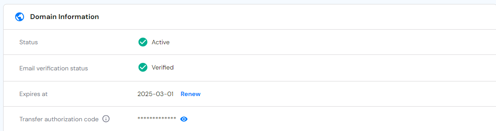

## Contributing

We welcome contributions from the community! Whether you want to report a bug, suggest a new feature, or submit a pull request, we appreciate your help. Please review our [Contribution Guidelines](CONTRIBUTING.md) for more information.

## Contact

If you have any questions or feedback, feel free to reach out to us at [contact@dev.wicaksonollc.com](mailto:contact@dev.wicaksonollc.com). We'd love to hear from you!

## Link Custom domain

[https://perlite.marlowsyards.shop/](https://perlite.marlowsyards.shop/)
