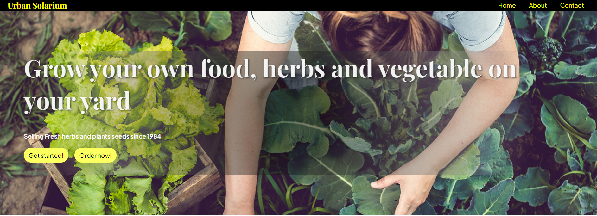
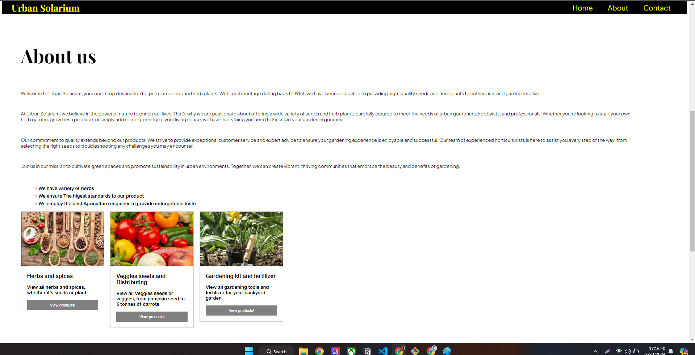
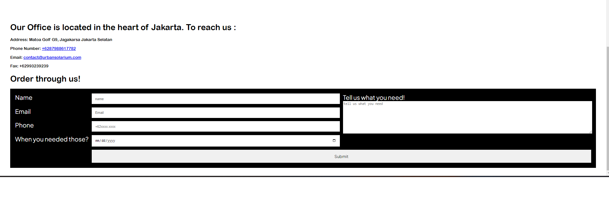
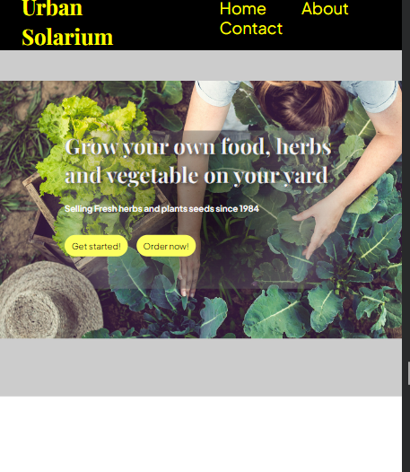
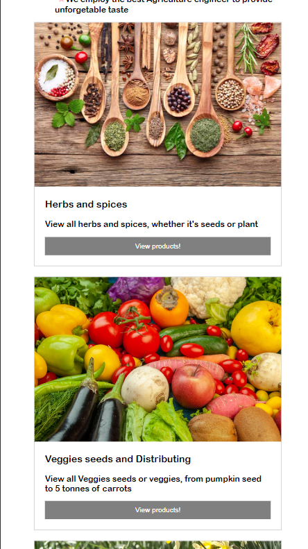
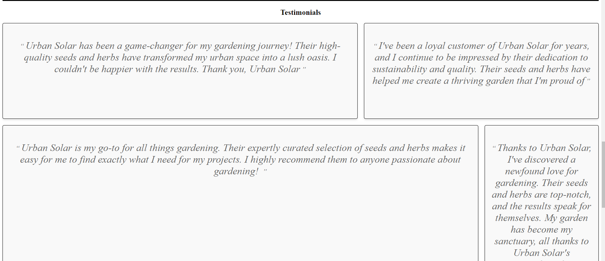

# Welcome to My Project

This project is designed to help you get started with Wicaksono LLC website . Whether you're a developer looking to contribute or a user interested in learning more, you've come to the right place!

## About this website

Wicaksono LLC is a revolutionary platform that aims to simplify website making with a third party. With a user-friendly interface and powerful features, Wicaksono LLC empowers users to have their own landing page for their business

## Getting Started

To get started with Wicaksono LLC, follow these simple steps:

1. Clone the repository to your local machine.
2. Install the necessary dependencies.
3. Run the application.
4. Explore the features and functionalities.

For detailed installation instructions, please refer to the [Documentation](#).

## Screenshots

### Dashboard

### About us

### Reach us 

### Mobile view 1

### mobile view 2

### Scrset 

### testimonials 

## Contributing

We welcome contributions from the community! Whether you want to report a bug, suggest a new feature, or submit a pull request, we appreciate your help. Please review our [Contribution Guidelines](CONTRIBUTING.md) for more information.

## Contact

If you have any questions or feedback, feel free to reach out to us at [contact@dev.wicaksonollc.com](mailto:contact@dev.wicaksonollc.com). We'd love to hear from you!

## Link netlify
w
[Ini link nya](https://65dac74e24fc2a8083409907--peppy-croquembouche-781b73.netlify.app/)
